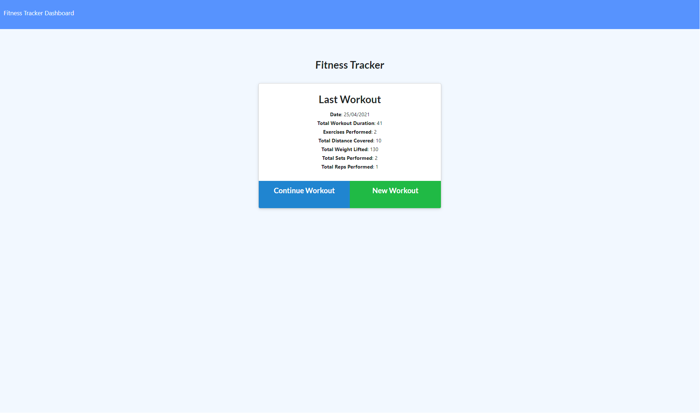
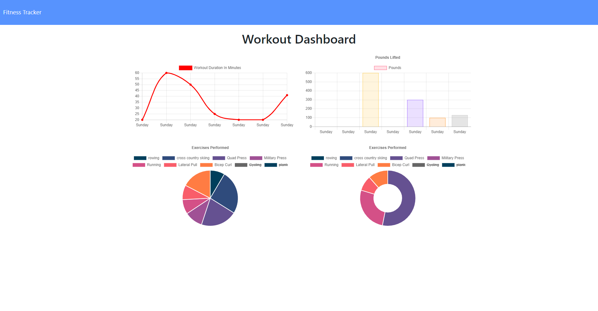

# Workout Tracker   

## Description

An application that allows a user to track their activity by logging workouts and exercises within those workouts. The type of workout (cardio or resistance training)  along with relavent details such as duration and distance (for cardio) or weight, reps, sets, and duration for resistance.  This data is then displayed on a dashboard where the cumulative totals of duration and weights are displayed. along with the names of the exercises performed.  

## Table of Contents

  - [Workout Tracker](#Workout-Tracker)
  - [Description](##description)
  - [Table of Contents](##table-of-contents)
  - [Installation](##installation)
  - [Usage](##usage)
  - [License](##license)
  - [Contributors](##contributors)
  - [Technologies Used](##technologies-used)
  - [Future versions](##future-versions)

## Installation

It can be run locally from the github repository, once packages are installed and the database is created and seeded from the enclosed seed files and schema.  It is also deployed live at heroku. 

## Usage

The live deployed site is found at: https://obscure-tundra-45842.herokuapp.com/

A screenshot where you can add new exercises

A screenshot of the dashboard where you can see the returned data

## License

License with MIT

## Contributors

This app is the sole work of [Claire Davies](https://github.com/ClaireMDavies)

## Technologies Used

- Javascript
- node.js
- mongoose
- heroku
- express
- html
- css
- bootstrap
- mongoDB Atlas
- morgan
- Robo3T

## Future Versions

As the starter code was provided for us, and the purpose of creating the app was creating the routes, models, and server whilst using a monogoDB database there was lot of functionality on the front end that would need addressing in future versions. These are detailed below.  

- To decrease the number of reps, weight etc that was going into the input fields on the exercise, it immediately took you into negative numbers.  This would need to be addressed, and the ability to go into negative numbers be removed. 
- The UI was incredibly unclear, with the user left not knowing the difference between adding an exercise or completing an exercise.  If an exercise was added, and the completed button then clicked immediately afterwards, then an empty form was sent to the database, despite models set up with some of those fields as required. The UI needs to be clearer, with information fed back to the user should they be interacting with the app incorrectly.
- Whilst the dashboard field needed to be populated with the cumulative totals of the last 7 workouts, should there be more than one exercise in the workout, all but the first exercise was struck through.  The cumulative totals worked, but the purpose of the strike through was not apparent, or really required. 
